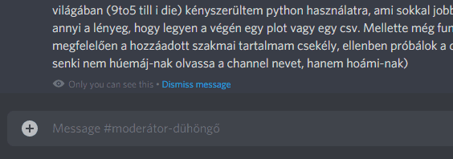

<h1 align="center">Whoami Discord Bot</h1>

    <strong>
        Bemutatkozásokat kezelő bot a <a href="https://discord.gg/A5yC5Hhxrs">Step into Community</a> Discord szerveren.
    </strong>

 

 

## Funkcionalitás

  * **Bemutatkozó csatorna.** A bot egy választott bemutatkozó csatornában (`#whoami` a Step into Community szerveren) várja a bemutatkozó üzeneteket. Mindenkinek a legutolsó, ebben a csatornában elhelyezett üzenete lesz a bemutatkozása.
  * **Bemutakozások megjelenítése.** A `/whois <user>` parancsra válaszolva a bot megjeleníti a `user` felhasználó bemutatkozását (amennyiben létezik).

    

## Jellemzők

  * **Nincs perzisztencia.** Az alkalmazás nem tárol a lemezen semmit, csupán memóriában cache-el adatokat.
  * **Fix szerver és csatorna.** Az alkalmazás környezeti változóban várja a tartalmazó szerver (guild), valamint a bemutatkozó csatorna azonosítóját. Bár a bot *non-public*, azonban a biztonság kedvéért úgy gondoltuk, érdemes lehet kódban is kikényszeríteni, hogy csak a Step into Community szerveren működjön.

## Fordítás és futtatás

A fordításhoz a következőkre van szükség:

  * Java 1.8 vagy afölötti verzió.

Ezután a tényleges fordítás (JAR összeállítása):

~~~~
$ ./mvnw package
~~~~

Majd pedig az elkészült JAR futtatása:

~~~~
$ java -jar ./target/whoami-discord-bot-1.0.0.jar
~~~~

## Konfiguráció

> [StartupConfiguration.kt](src/main/kotlin/hu/stepintomeetups/whoami/configuration/StartupConfiguration.kt)

Az alkalmazás az alábbi környezeti változókat várja:

  * `WHOAMI_BOT_TOKEN`
    * A bot számára generált token.
  * `WHOAMI_INTRODUCTION_CHANNEL_IDENTIFIER`
    * A bemutatkozó csatorna azonosítója. Innen fogja tudni a bot, hogy mely csatornában kell keresni a bemutatkozó üzeneteket.
  * `WHOAMI_GUILD_IDENTIFIER`
    * Az egyetlen szerver azonosítója, melyen a bot kizárólagosan üzemel.

## Licenc

Az alkalmazásra az [MIT License](LICENSE) vonatkozik.
